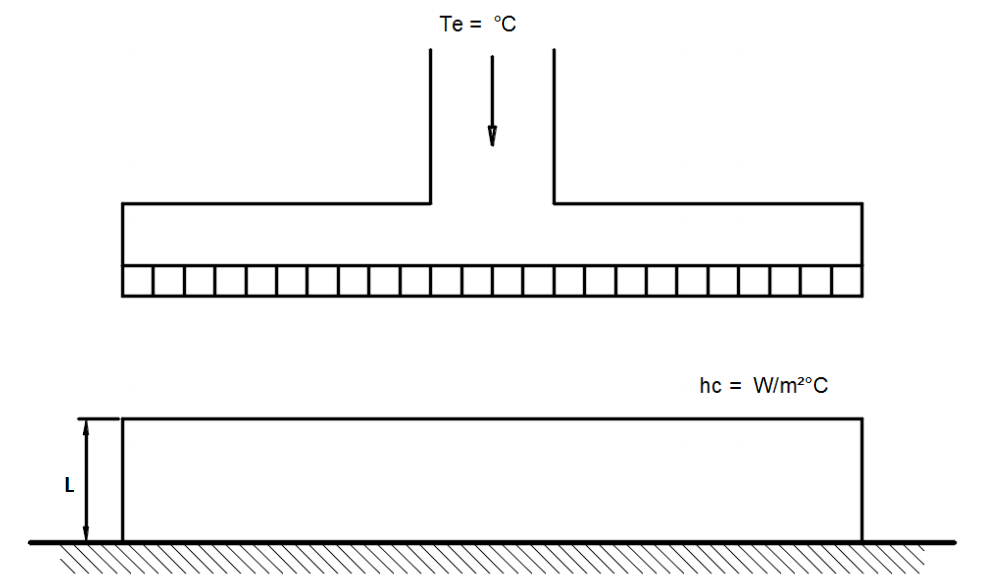
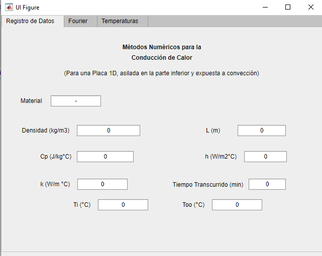
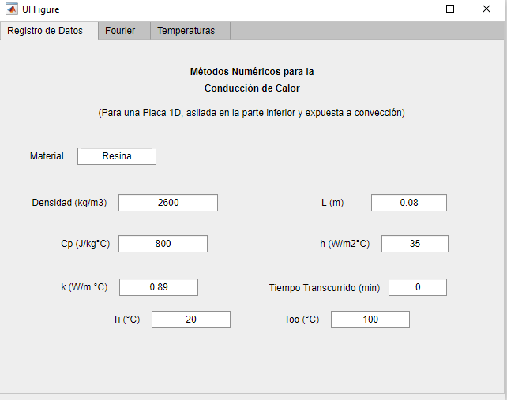
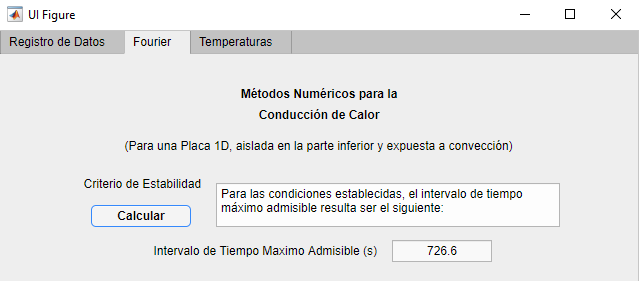
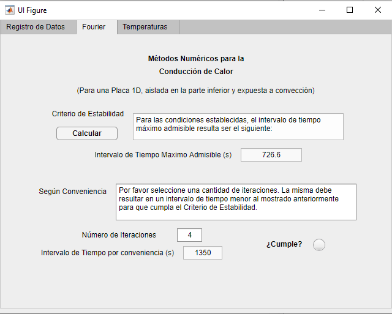
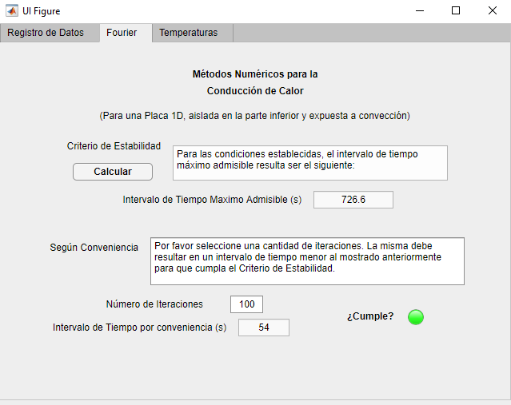
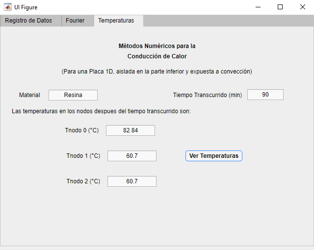

# Métodos Númericos para la Conducción de Calor
___

Programa hecho en Matlab usando App Designer, para analizar la transferencia de calor en un curador de resinas. Las resinas pueden ser de espesor variable y de diferentes materiales. Trabaja con el método de diferencias finitas explícito.  

En la siguiente imagen se muestra el esquema del curador de resinas:  

  

 

Se hacen las siguientes consideraciones:
* Se considera un sistema de régimen transitorio en una dimensión.
* Coordenadas rectangulares.
* Se toma la superficie inferior como aislada.
* Se considera la transferencia de calor por convección y por conducción.
* Se consideran tres regiones M=3.
* Se asume que 𝑇i  = 𝑇0i  = 𝑇1i  = 𝑇2i  = Temperatura inicial de la resina ( °𝐶 )  

Al introducir los siguientes datos:
* Material de la resina
* Densidad ( ρ ) [ kg/m3 ]
* Espesor ( L ) [ m ]
* Calor Especifico ( Cp ) [ J/kg °𝐶 ]
* Coeficiente de Transferencia de Calor por convección ( h ) [ W/m2 °𝐶 ]
* Conductividad Térmica ( k ) [ W/m °𝐶 ]
* Tiempo Transcurrido [ minutos ]
* Temperatura Inicial ( Ti ) [ °𝐶 ]
* Temperatura del aire ( Too ) [ °𝐶 ]

## Como se Utiliza?
---
1. Se debe tener instalado Matlab. 
1. Para iniciar el programa dar doble click al mismo en la carpeta donde se ubique.  
   
  **Nota:** Si no se abre o se abre de manera incorrecta, escribir en la ventana de comandos o Command Window " _**appdesigner**_ "  y abrir desde la ventana emergente localizando el archivo y despues presionando el botón **Run**.  
  1. Se abrira el programa listo para utilizar. Se deben introducir los datos iniciales que se solicitan en la pestaña _Registro de Datos_. 
   
   
  1. Luego, dirigirse a la pestaña _Fourier_. Allí el programa aplica el criterio de estabilidad para determinar el máximo ∆t, al dar click en el botón **Calcular**.  
   
  1. Posteriormente, se solicita introducir el número de iteraciones que desea que el programa realice, las mismas se seleccionan a conveniencia del usuario. El programa automaticamente revisará si estas cumplen con el criterio de estabilidad y mostrará el diferencial de tiempo que corresponde a ese número de iteraciones. Si lo cumplen se encendera la luz verde.  
  En este caso no cumple:  
    
  En este caso lo cumple:  
   
  1. Despues dirijase a la pestaña _Temperaturas_. Al dar click en el botón **Ver Temperaturas**, apareceran las temperaturas correspondientes a los tres nodos considerados de la resina en el tiempo transcurrido. 
  **Nota:** Según el número de iteraciones, este resultado podría tardar más en resolverse.
    
  La ubicación de esos tres nodos en la resina se obtiene mediante la ecuación: ∆x = L/( M- 1 ), siendo la distancia desde el origen del nodo central.

___
___
